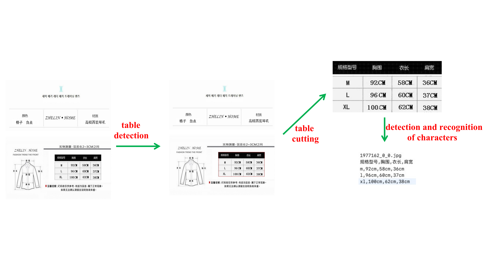

The code is to realize the table detection and character recognition in document. The method process is shown in following figure:

## Installation

See [INSTALL.md](https://detectron2.readthedocs.io/tutorials/INSTALL.md).

## Whole Process 
- Search the picture with table
- table cutting
- Cell detection
- table recognition

### Method 1
Command

     "sh run_whole_final.sh"

Parameters:

--test_data_path  

path of input images

--checkpoint_path=checkpoint/detect 

path of model weights

--output_chart_path 

primary path of output of  table detection

    --output_chart_origin 
    
    secondary path，which saves the original images with tables and json file recorded the bounding boxes of tables in images.
    
     --output_chart_view   
     
     secondary path，which saves the visualization of table detection of original images.
     
--output_nochart_path  
path that saves the original images without tables

--out_detect_path  
primary path, which saves the  recognition results of characters in tables

      --out_detect_cut  
      secondary path, which saves the images of table cutting and bounding boxes of characters.
      
      --out_detect_view 
      secondary path, which saves the visualization of character recognition in table.
      
--output_recog_path 
directory, which records the resuts of character recognition 

### Method 2
Semi process mode
- put original images into data_new
- table detection
"run_detect.sh"
-  character recognition
"run_reg.sh"
[detection + recognition]
"run_detect_reg.sh"
- results
detection results: data_new/jsondata
recognition results: Result/reg.txt
